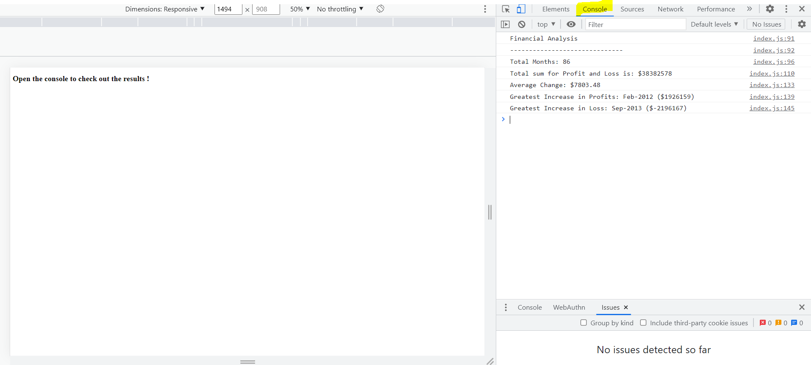

# mm-console-Finances

## Project description

This week' bootcamp challenge was to create a code for analyzing the financial records of a company. we were provided with a financial dataset.

Instructions: <br>
Your task is to write JavaScript code that analyzes the records to calculate each of the following:

* The total number of months included in the dataset.

* The net total amount of Profit/Losses over the entire period.

* The average of the **changes** in Profit/Losses over the entire period.
  * You will need to track what the total change in profits are from month to month and then find the average.
  * (`Total/Number of months`)

* The greatest increase in profits (date and amount) over the entire period.

* The greatest decrease in losses (date and amount) over the entire period.

When you open your code in the browser your resulting analysis should look similar to the following:

  ```text
  Financial Analysis
  ----------------------------
  Total Months: 25
  Total: $2561231
  Average  Change: $-2315.12
  Greatest Increase in Profits: Feb-2012 ($1926159)
  Greatest Decrease in Profits: Sep-2013 ($-2196167)
  ```

Your final code should print the analysis to the console.

**Hints:**

* You will need to do some research on your own for this project!

* Remember, in order to combine strings and variables in the console you will need to use **concatenation**.

* How do you only print to the nearest 100th in JavaScript?

## Usage
To view the final results, you will need to open the page in the browser [Deployed landing page](https://maudmain.github.io/mm-console-Finances/) and open the Dev Tool console.

The result will appear as such:



## Credits

- edX Bootcamp: for project brief and criterias, tutorial and ressources

 What I have learned/ Resources:
- Multi-dimensional array, https://www.javascripttutorial.net/javascript-multidimensional-array/#:~:text=To%20access%20an%20element%20of,element%20of%20the%20inner%20array
- Arrow function, https://developer.mozilla.org/en-US/docs/Web/JavaScript/Reference/Functions/Arrow_functions
- Array reduce, https://developer.mozilla.org/en-US/docs/Web/JavaScript/Reference/Global_Objects/Array/reduce
- to.fixed https://developer.mozilla.org/en-US/docs/Web/JavaScript/Reference/Global_Objects/Number/toFixed
- Template literals https://developer.mozilla.org/en-US/docs/Web/JavaScript/Reference/Template_literals


## License
MIT